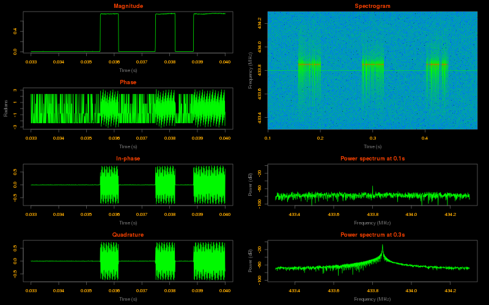

iq
==

This package offers a convenient way to parse and analyze I/Q files like those
produced by an [RTL-SDR][rtl-sdr-home] dongle.

Example
=======

The following is the output obtained by running [example.R](example/example.R).



Features
========

See the embedded R documentation for the full reference; here is an overview of
the available functions:

 * Load from (`iq::FromFile`) and save to (`iq::ToFile`) plain or compressed
   binary files.

 * Cut and resample a signal (`iq::Resample`).

 * Extract ranges of complex I/Q values from the signal (`iq::SampleRange`)
   on-demand to avoid overloading the available memory.

 * Compute some common operations over complex I/Q values (`iq::Magnitude`,
   `iq::Phase`, etc.).

 * Perform power spectrum analysis (`iq::Spectrum` and `iq::Spectrogram`) of the
   signal using builtin (`iq::Rectangular`, `iq::Hamming`, etc.) or custom
   window functions.

Installation
============

Using [`devtools`][devtools]:

```R
devtools::install_github('cyrus-and/iq')
```

Motivation
==========

Although there are already a [whole][rtl-sdr-apps-1] [bunch][rtl-sdr-apps-2] of
related software, I thought, as a newbie to the SDR world, that writing this
library would be a good opportunity to both delve a bit into the unfamiliar
topic of signal analysis and to gain some expertise on the R package
development.

This is also an attempt to answer the question: *"Well, I've captured something
with [`rtl_sdr`][rtl-sdr-software], now what?"* which is probably obvious for
someone in the field but quite confusing for newcomers.

[rtl-sdr-home]: http://www.rtl-sdr.com/
[devtools]: https://github.com/hadley/devtools
[rtl-sdr-apps-1]: http://sdr.osmocom.org/trac/wiki/rtl-sdr#KnownApps
[rtl-sdr-apps-2]: http://www.rtl-sdr.com/big-list-rtl-sdr-supported-software/
[rtl-sdr-software]: http://sdr.osmocom.org/trac/wiki/rtl-sdr#rtl_sdr
