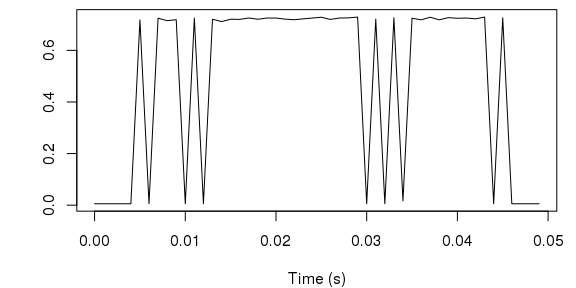
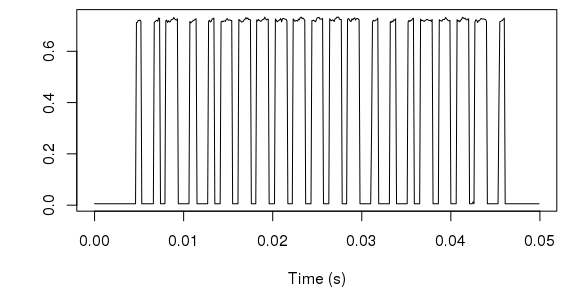

Creating and loading a binary file
----------------------------------

Let us assume to have just captured some samples from your RTL-SDR
device, for example with:

    rtl_sdr signal.bin -f 433.8e6 -s 1e6

This command tunes the device to 433.8 MHz and start capturing samples
at a rate of 1 million per second (1 MHz).

In this walkthrough we will use the `example/signal.bin.bz2` file which
represents the signal generated by a RF remote control.

    signal <- iq::FromFile('../example/signal.bin.bz2',
                           carrier.frequency = 433.8e6,
                           sample.rate       = 1e6)

This file has been compressed with bzip2 in order to save some space but
as you can see, `iq::FromFile` handles the decompression transparently.

`signal` is a named list with some useful (read-only) fields, in
particular:

-   `n.samples` is the number of available samples;
-   `duration` is the signal duration in seconds.

Files produced in this way may quickly grow quite large and thus become
hard to manage and especially to plot, for this reason `iq` extracts and
convert the samples only when explicitly needed.

Spectral analysis
-----------------

A first thing we may want to do with our signal is to take a quick look
at its spectrogram. We do so using the `iq::Spectrogram` function
setting a limit to the number segments that are extracted from the
signal.

The default FFT window in `iq` is a rectangular window 1024 samples
wide.

    spectrogram <- iq::Spectrogram(signal, n.segments = 500)

The resulting object is a named list:

-   `x` is the time (`n.segments` long);
-   `y` is the frequency in Hz (`window$size` long);
-   `z` is the signal power in dB.

This format is conveniently supported by `graphics::image`.

    spectrogram$y <- spectrogram$y / 1e6 # from Hz to MHz

    image(spectrogram,
          xlab = 'Time (s)',
          ylab = 'Frequency (MHz)')

If we want to focus on a single segment we can use the `iq::Spectrogram`
function, we will plot the spectrum at two different times to see the
differences. The resulting object is a named list:

-   `frequency` is the frequency in Hz
-   `power` is the signal power in dB.

Both vectors are `window$size` long.

    spectrum <- iq::Spectrum(signal, at.time = 0.1)

    plot(spectrum$frequency / 1e6, spectrum$power,
         type = 'l',
         ylim = c(-100, 0),
         xlab = 'Frequency (MHz)',
         ylab = 'Power (dB)')

Compare now with the spectrum computed during the actual transmission.

    spectrum <- iq::Spectrum(signal, at.time = 0.3)

Now that we have a fair overview of the signal we may want to have a
more in-depth view of some particular portion, possibly changing the FFT
window function this time. There are a few builtin window function
available, let us try with a Hamming window 2048 samples wide. Follow
its plot.

Using this window we plot the spectrogram of the second transmission
burst.

    spectrogram <- iq::Spectrogram(signal,
                                   n.segments = 500,
                                   from.time  = 0.14,
                                   to.time    = 0.22,
                                   window     = hamming.2048)

Magnitude analysis
------------------

In order to analyze the signal magnitude we need to explicitly extract
the actual I/Q samples from the signal. `iq::SampleRange` does exactly
this allowing us to specify the maximum number of samples returned (and
the time/sample range as we will see). Here we are extracting just 1000
samples from the whole signal.

    range <- iq::SampleRange(signal, max.samples = 1000)

`range` is a named list with two fields:

-   `iq` is the complex I/Q vector;
-   `time` is the associated time scale.

To compute the signal magnitude we can use the utility function
`iq::Magnitude` as follows:

    plot(range$time, iq::Magnitude(range$iq),
         type = 'l',
         xlab = 'Time (s)',
         ylab = '')

Using 1000 samples only definitely strips away a lot of details but at
least we can get a glimpse of what is the structure of our signal: we
can see the 4 distinct bursts of transmission we already noticed in the
spectrogram. As previously mantioned, our signal is produced by a
general purpose RF remote control which keeps repeating the same pattern
as long as one keeps pressing the corresponding button on the device.

Let us focus on the third burst for example. We need to extract another
range of samples, this time we need to also specify the time range in
seconds.

    range <- iq::SampleRange(signal,
                             from.time   = 0.275,
                             to.time     = 0.325,
                             max.samples = 5000)

We could also cleanup the signal and emphasize the pattern. For example
we can threshold the magnitude using 0.4 as break-point.

    pattern <- ifelse(iq::Magnitude(range$iq) < 0.4, 0, 1)

Resample and save
-----------------

Similarly to `iq::SampleRange` it is possible to create a new signal by
cutting and resampling another one. This is useful in combination with
`iq::ToFile` which allows to save a signal in the usual binary format.
So for example we now try to extract the above range using a lower
sample rate (1 KHz instead of 1 Mhz).

    signal.1khz <- iq::Resample(signal,
                                from.time       = 0.275,
                                to.time         = 0.325,
                                new.sample.rate = 1e3)

Notice how we do not need to specify a time range this time when
extracting the I/Q values.

    range <- iq::SampleRange(signal.1khz)

As you can see this plot is quite different from the above, this is
because the chosen sample rate is to low. A sampling rate of 1 KHz means
that two consecutive samples are spaced by 1 ms and our resampled signal
is just 50 ms long and exibits about 40 level changes. Let us try with
10 KHz instead.

    signal.10khz <- iq::Resample(signal,
                                 from.time       = 0.275,
                                 to.time         = 0.325,
                                 new.sample.rate = 10e3)

Now the result is acceptable, at least the pattern is clearly visible.
We can now save this new signal to a file:

    iq::ToFile(signal.10khz, 'example/signal-10khz.bin.bz2')

`iq::ToFile` uses the file extension to apply the proper compression
automatically, if supported. Here for example we are using bzip2.
